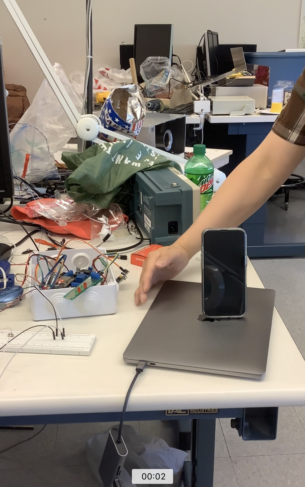
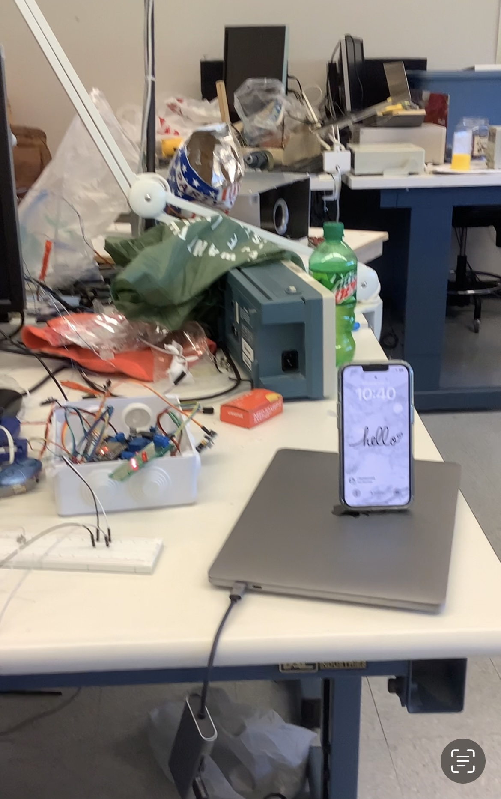

# anti-theft-catalytic-converter

For this project, I collaborated with 2 other electrical engineering students and 1 mechanical engineering student to develop an Anti-theft System for Catalytic Converter. In US, catalytic converter theft is rising fast, so we wanted to counter that. On the electrical side, the system has 2 motion sensors and a layer full of electrically conductive wires. Upon receving suspicious motion detection from the motion sensors or when the layer of wires is damaged (possibly because someone is trying to steal the converter and break the wire), the main controller will trigger alarm and send a notification via text message to the user. 

The full system implementation is in folder ESP-32. However, the sending text message feature had 3 major versions:

1. At first, the feature was implemented using SIM800L module, which can send texts using 2G network. Raspberry Pi Pico was chosen as the controller. In MicroPython, I wrote the driver for SIM800L such that the Pico can communicate with it via UART protocol. However, in 3/2023, 2G network was shut down in the US, so we stop using this method. The full implementation and testing are in folder `Pi-Pico-and-SIM800L-deprecated`. 
2. The SMS funtionality was then implemented on Microchip AVR-IOT Cellular Mini module. This module is capable of 5G communication. The SMS function was successfully implemented and tested on the module using C++ syntax with Arduino libraries, but due to overheat, the module stop working. The full implementation is in folder `avr-iot-5g-deprecated`.
3. Finally, a temporary version of the SMS was implemented on ESP-32 module. The module connects to WiFi network, then sends HTTP requests to Twillo - a microservice handling phone call and SMS. The full implementation is in folder `ESP-32`.